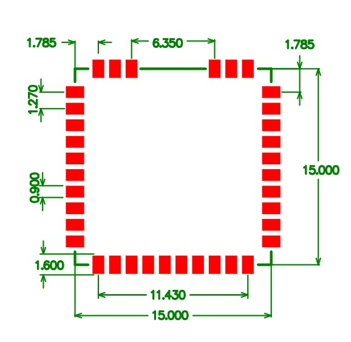
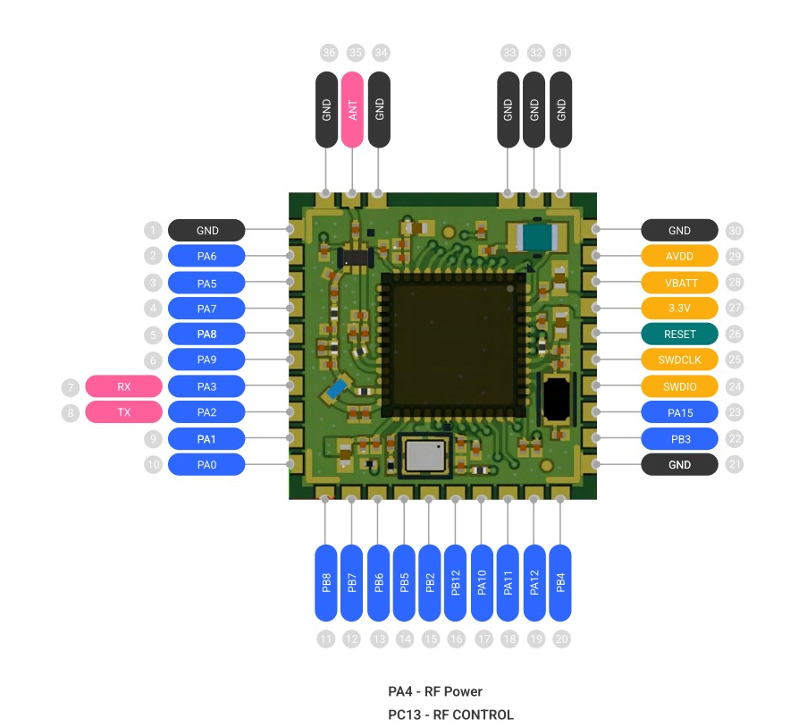

### LoRa Module SDK

### STM32WLE5 Core Specifications

| Specification       | Value            |
|---------------------|------------------|
| Core                | ARM Cortex-M4    |
| Flash Size          | 256 kB           |
| ADC                 | 12-bit           |
| Max Clock           | 48 MHz           |
| Number of I/O       | 21               |
| RAM (DRAM)          | 64 kB            |
| Operating Voltage   | 1.8V – 3.6V      |
| Temperature Range   | -40°C to +80°C   |

### Diamentions

### Pinout

